# Manual de Usuario — ParallelVision 👁️🚀

Pipeline de procesamiento masivo de imágenes con CPU + GPU

**Universidad Nacional de La Matanza (UNLaM)**
Programación Concurrente · 1° Cuatrimestre 2026 · Trabajo Práctico Integrador

| Integrantes | DNI |
| --- | --- |
| Felice, Tomás Agustín | 44.789.809 |
| De La Cruz Zamudio, Axel Nahuel | 41.063.583 |
| Graneros, Brian Ariel | 41.130.084 |

---

## Índice

1. [¿Qué es ParallelVision?](#1-qué-es-parallelvision)
2. [Antes de empezar (requisitos)](#2-antes-de-empezar-requisitos)
3. [Instalación](#3-instalación)
4. [Modo 1 — Dashboard web (recomendado)](#4-modo-1--dashboard-web-recomendado)
5. [Modo 2 — Línea de comandos (CLI)](#5-modo-2--línea-de-comandos-cli)
6. [Operaciones disponibles](#6-operaciones-disponibles)
7. [Interpretar los resultados](#7-interpretar-los-resultados)
8. [Preguntas frecuentes y solución de problemas](#8-preguntas-frecuentes-y-solución-de-problemas)

---

## 1. ¿Qué es ParallelVision?

**ParallelVision** aplica filtros y transformaciones a **grandes volúmenes de imágenes**
de forma rápida, aprovechando al máximo el hardware de tu computadora. En lugar de procesar
las imágenes una por una, reparte el trabajo en varios hilos de CPU y, si hay una placa de
video compatible, la usa para acelerar aún más el procesamiento.

Como usuario solo tenés que hacer tres cosas:

1. Indicar la **carpeta con las imágenes** a procesar.
2. Elegir la **operación** (escala de grises, bordes, desenfoque o ecualización).
3. Presionar **Iniciar** y observar el progreso.

El sistema detecta **solo** el mejor motor de procesamiento disponible (GPU NVIDIA →
GPU AMD/Intel → CPU). **No necesitás configurar nada de hardware**: funciona en cualquier
máquina, con o sin placa de video.

Hay dos formas de usarlo:

| Modo | Para quién | Interfaz |
| --- | --- | --- |
| **Dashboard web** | Uso general, ver progreso y comparativas | Navegador |
| **CLI (consola)** | Automatización, sin interfaz gráfica | Terminal |

---

## 2. Antes de empezar (requisitos)

Para el uso normal (dashboard o CLI en CPU) solo necesitás:

- **Python 3.11 o superior** (probado en 3.12).
- **Node.js 18 o superior** + npm — *solo* si vas a usar el dashboard web.
- **git** para clonar el repositorio.
- Un **navegador moderno** (Chrome, Edge o Firefox recientes) para el dashboard.

> 💡 **La GPU es opcional.** Si tu equipo no tiene placa de video compatible, el sistema
> usa automáticamente la CPU. La aceleración por GPU (NVIDIA/CUDA o AMD-Intel/OpenCL)
> requiere tener instalados los drivers correspondientes, pero **no es obligatoria**.

---

## 3. Instalación

Abrí una terminal y ejecutá los siguientes pasos.

```bash
# 1. Clonar el repositorio
git clone https://github.com/UNLAM-PROG-C/2026-PROGC-Q1-M6.git
cd 2026-PROGC-Q1-M6/TP-Integrador

# 2. Crear y activar el entorno virtual de Python
python -m venv venv
source venv/bin/activate        # Linux / macOS
# .\venv\Scripts\activate       # Windows (PowerShell)

# 3. Instalar las dependencias del backend
pip install -r requirements.txt
```

> 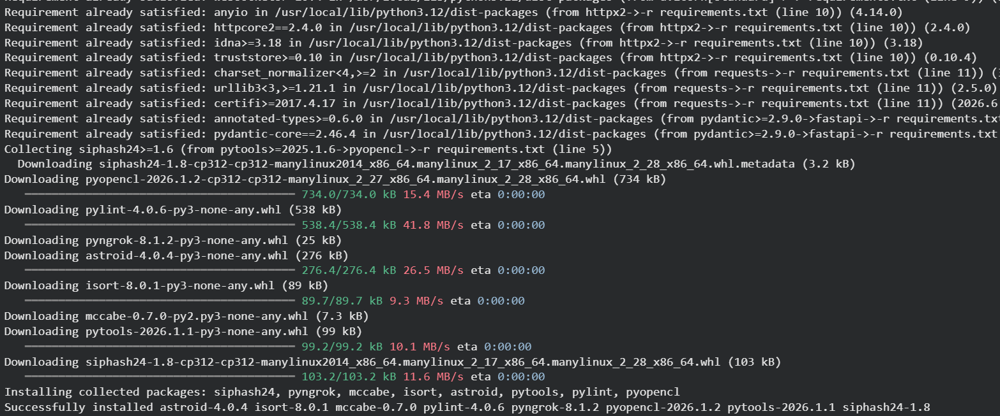

**¿No tenés imágenes para probar?** El proyecto incluye un script que descarga imágenes
de prueba automáticamente:

```bash
python scripts/descargar_imagenes.py -n 100 -d public/images/in
```

Esto deja 100 imágenes aleatorias en la carpeta `public/images/in`, lista para usar.

---

## 4. Modo 1 — Dashboard web (recomendado)

El dashboard es una página web que muestra el progreso imagen por imagen y una comparativa
de rendimiento **CPU vs GPU** en tiempo real. Funciona con dos procesos: el **backend**
(servidor) y el **frontend** (la página).

### 4.1. Iniciar el sistema

Necesitás **dos terminales abiertas** al mismo tiempo, ambas dentro de `TP-Integrador`.

**Terminal 1 — Backend** (servidor de la API, con el entorno virtual activado):

```bash
python -m uvicorn api.main:app --reload
```

Debe quedar escuchando en `http://localhost:8000`.

**Terminal 2 — Frontend** (la interfaz web):

```bash
cd frontend
npm install      # solo la primera vez
npm run dev
```

Cuando termine, abrí en el navegador la dirección que indica Vite, normalmente:

```
http://localhost:5173
```

> 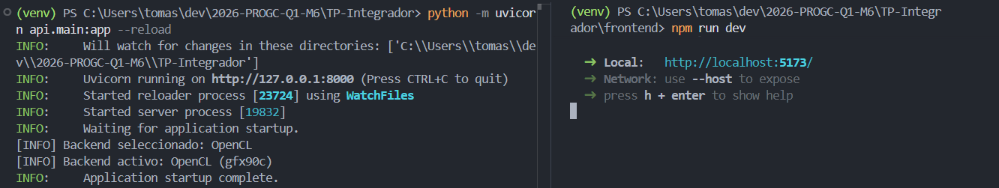

### 4.2. Conocer la pantalla principal

Al abrir el dashboard vas a ver un encabezado con el logo **ParallelVision** y, a la
derecha, una **insignia (badge) del backend detectado**:

- 🟢 **GPU** (ej. `CUDABackend · NVIDIA GeForce…`) si detectó placa de video.
- ⚙️ **CPU** (ej. `CPUBackend · CPU`) si va a usar los hilos del procesador.

Debajo, la pantalla se divide en dos columnas:

- **Izquierda:** el panel de **Configuración**.
- **Derecha:** el **Progreso en tiempo real**, el **gráfico de speedup** y la **tabla de
  resultados** (aparecen a medida que corre y termina el procesamiento).

> 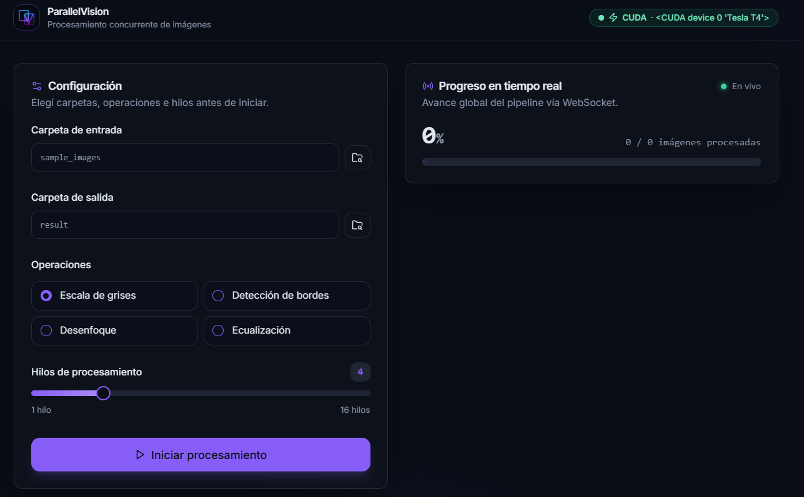

### 4.3. Configurar el procesamiento

En el panel **Configuración** (izquierda), completá los cuatro campos:

1. **Carpeta de entrada** — hacé clic en el campo para abrir el explorador de carpetas.
   Navegá por el árbol de directorios (o pegá la ruta directamente) y presioná
   **"Elegir esta carpeta"**. Es la carpeta que contiene las imágenes a procesar.

2. **Carpeta de salida** — de la misma forma, elegí dónde se guardarán las imágenes ya
   procesadas.

3. **Operaciones** — elegí una de las cuatro transformaciones (ver
   [sección 6](#6-operaciones-disponibles)): *Escala de grises*, *Detección de bordes*,
   *Desenfoque* o *Ecualización*.

4. **Hilos de procesamiento** — deslizá el control para elegir cuántos hilos de CPU
   usar (de **1 a 16**). Más hilos suele significar más velocidad, hasta el límite de
   núcleos de tu procesador.

> 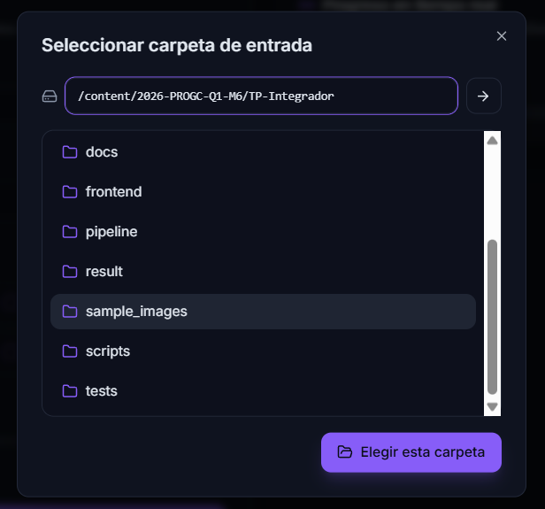
>
> 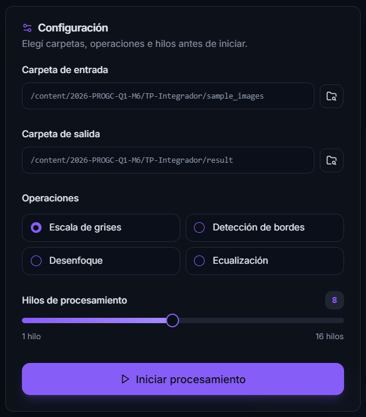

El botón **"Iniciar procesamiento"** se habilita solo cuando hayas seleccionado **ambas
carpetas y una operación**. Si falta algo, aparece el mensaje *"Seleccioná ambas carpetas
y al menos una operación."*.

### 4.4. Iniciar y ver el progreso

Presioná **▶ Iniciar procesamiento**. El panel **Progreso en tiempo real** empieza a
actualizarse vía WebSocket:

- Un porcentaje grande (ej. **47 %**) y el contador **`current / total` imágenes
  procesadas**.
- Una barra de progreso.
- Un indicador de conexión: 🟢 **"En vivo"** mientras está conectado.

> 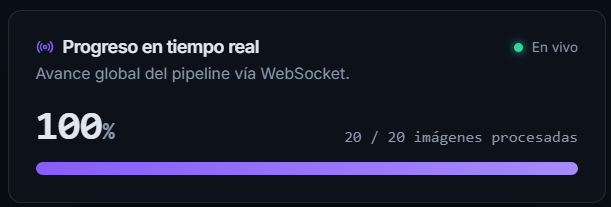

### 4.5. Gráfico de Speedup (CPU vs GPU)

Mientras corre, aparece el gráfico **"Speedup CPU vs GPU — tiempos por lote"**. Muestra
dos líneas con los milisegundos que tarda cada motor en procesar cada lote de imágenes:

- 🔴 **CPU** (línea roja).
- 🔵 **GPU** (línea azul).

Cuanto **más baja** esté la línea azul respecto de la roja, mayor es la ventaja de la GPU.

> 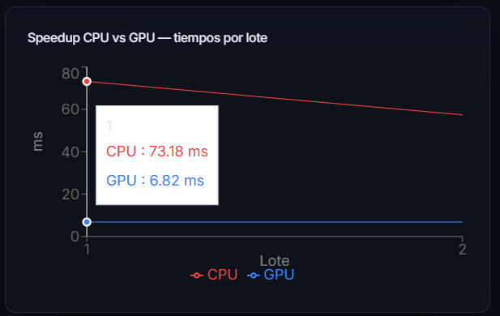

### 4.6. Tabla de resultados y exportación a CSV

Al **finalizar** el procesamiento aparece la tabla **"Resultados por operación"** con,
para cada operación: **CPU prom (ms)**, **GPU prom (ms)** y **Speedup** (ej. `8.30×`).

El botón **"Exportar CSV"** descarga estos resultados como archivo `.csv` para conservar
el reporte o abrirlo en una planilla.

> 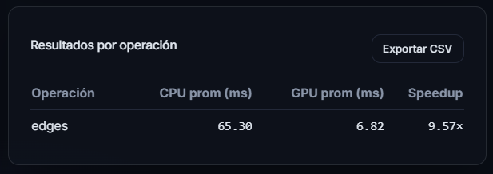

### 4.7. Galería de resultados e inspector

Más abajo, la **Galería de Resultados** muestra las miniaturas de todas las imágenes ya
procesadas (se refresca sola al terminar, y también con el botón **"Actualizar"**).

Al hacer clic en cualquier miniatura se abre el **Inspector**, con un **comparador
"antes / después"**: una barra deslizante para comparar la imagen original con la
transformada. Con las flechas **◀ ▶** navegás entre todas las imágenes.

> 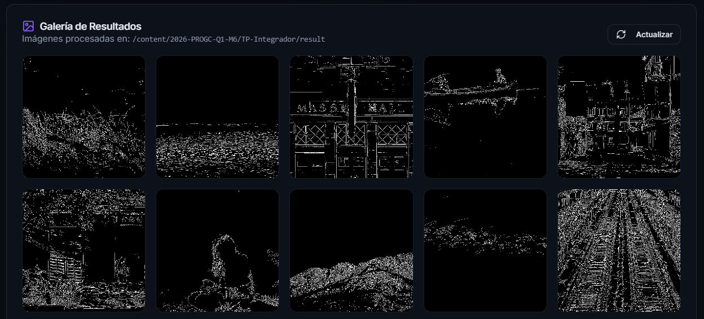
>
> 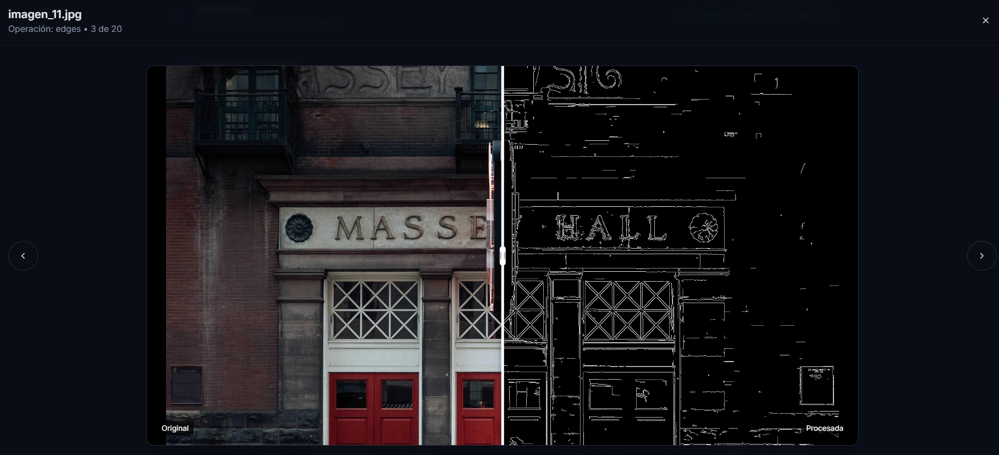

---

## 5. Modo 2 — Línea de comandos (CLI)

Si preferís no usar la interfaz web, podés procesar una carpeta directamente desde la
terminal (con el entorno virtual activado):

```bash
python main.py --input-dir ruta/a/imagenes --operation blur
```

### Opciones principales

| Flag | Descripción | Valor por defecto |
| --- | --- | --- |
| `--input-dir` | Carpeta con las imágenes a procesar (**obligatorio**). | — |
| `--operation` | `grayscale` · `edges` · `blur` · `equalize` (**obligatorio**). | — |
| `--workers` | Cantidad de hilos de CPU. | según el sistema |
| `--queue-size` | Tamaño de la cola interna. | valor por defecto |
| `--output-dir` | Carpeta donde guardar los resultados. | `result` |
| `--report archivo.csv` | Exporta un reporte de métricas a CSV. | — |
| `--no-save` | Procesa sin guardar las imágenes (solo mide rendimiento). | desactivado |

Para ver la ayuda completa:

```bash
python main.py --help
```

### Ejemplo de salida

Al terminar, la CLI imprime el backend usado, la cantidad de imágenes, el tiempo total,
el *throughput* (imágenes por segundo) y un resumen por operación:

```text
[INFO] Backend activo: CUDABackend
[INFO] Procesadas 100 imágenes en 3.42 s (29.24 img/s)

Resumen por operación:
  blur  →  count=100  avg=12.3 ms  min=9.8 ms  max=21.1 ms
```

> 📸 _Captura sugerida:_ la terminal con el resumen final del procesamiento CLI.
>
> 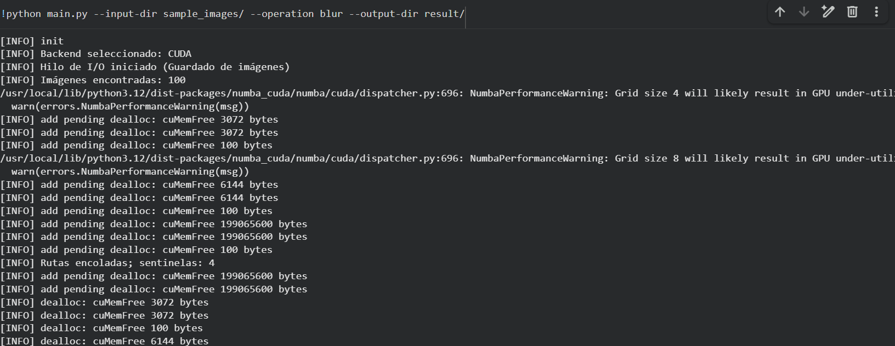
> 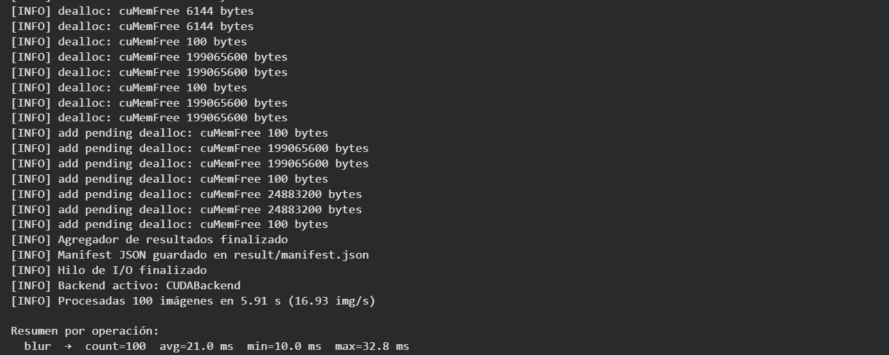

---

## 6. Operaciones disponibles

| Operación | Nombre en el dashboard | Qué hace |
| --- | --- | --- |
| `grayscale` | **Escala de grises** | Convierte la imagen a blanco y negro. |
| `edges` | **Detección de bordes** | Resalta los contornos (filtro Sobel). |
| `blur` | **Desenfoque** | Aplica un desenfoque gaussiano (suaviza la imagen). |
| `equalize` | **Ecualización** | Mejora el contraste ecualizando el histograma. |

---

## 7. Interpretar los resultados

- **Speedup (ej. `8.30×`):** cuántas veces más rápido fue el motor GPU frente a la CPU
  para esa operación. Un `4.5×` significa "4,5 veces más rápido".
- **CPU prom / GPU prom (ms):** tiempo promedio, en milisegundos, que tardó cada motor en
  procesar una imagen (o lote).
- **Throughput (img/s):** cantidad de imágenes procesadas por segundo (en la CLI).
- **Sin GPU:** si el sistema corre en CPU, la columna GPU y el speedup muestran `—`,
  lo cual es esperable y correcto.

Las imágenes procesadas quedan en la **carpeta de salida** que elegiste, junto con un
archivo `manifest.json` que el dashboard usa para armar la galería.

---

## 8. Preguntas frecuentes y solución de problemas

**El badge dice "CPU" y esperaba GPU.**
El sistema no detectó una placa compatible o faltan drivers. Con NVIDIA se necesitan los
drivers + CUDA Toolkit; con AMD/Intel, drivers OpenCL. Igual funciona todo en CPU.

**El procesamiento con GPU integrada (ej. Ryzen) se satura o va lento.**
Las GPU integradas exponen OpenCL pero no rinden como una placa dedicada y pueden saturar el
pipeline. Para forzar el uso de CPU y saltear OpenCL, definí la variable de entorno
`PARALLELVISION_DISABLE_OPENCL=1` antes de iniciar el backend o la CLI:

```powershell
# Windows (PowerShell)
$env:PARALLELVISION_DISABLE_OPENCL = "1"; python main.py --input-dir ruta/a/imagenes
```

```bash
# Linux / macOS
PARALLELVISION_DISABLE_OPENCL=1 python main.py --input-dir ruta/a/imagenes
```

Solo afecta a OpenCL (la ruta CUDA de NVIDIA se mantiene). Para volver al comportamiento
normal, no definas la variable (o poné `=0`).

**El botón "Iniciar procesamiento" está deshabilitado.**
Faltó seleccionar la carpeta de entrada, la de salida o la operación. Completá los tres.

**Aparece "Sin imágenes en el directorio" o "Directorio no encontrado".**
La carpeta de entrada no existe o no contiene imágenes válidas. Verificá la ruta, o usá
el script de descarga de imágenes de prueba (ver [sección 3](#3-instalación)).

**"Pipeline ya en ejecución".**
Ya hay un procesamiento en curso. Esperá a que termine antes de iniciar otro.

**La galería dice que no encuentra `manifest.json`.**
El procesamiento todavía no terminó o la carpeta de salida es incorrecta. Esperá a que
finalice y presioná **"Actualizar"**.

**El dashboard no carga / no conecta.**
Verificá que **ambas** terminales estén corriendo (uvicorn en `:8000` y Vite en `:5173`)
y que abriste la dirección que indicó Vite.

---

> 📖 Documentación técnica y de arquitectura: ver el [README](../README.md) y la carpeta
> [`docs/`](.).
